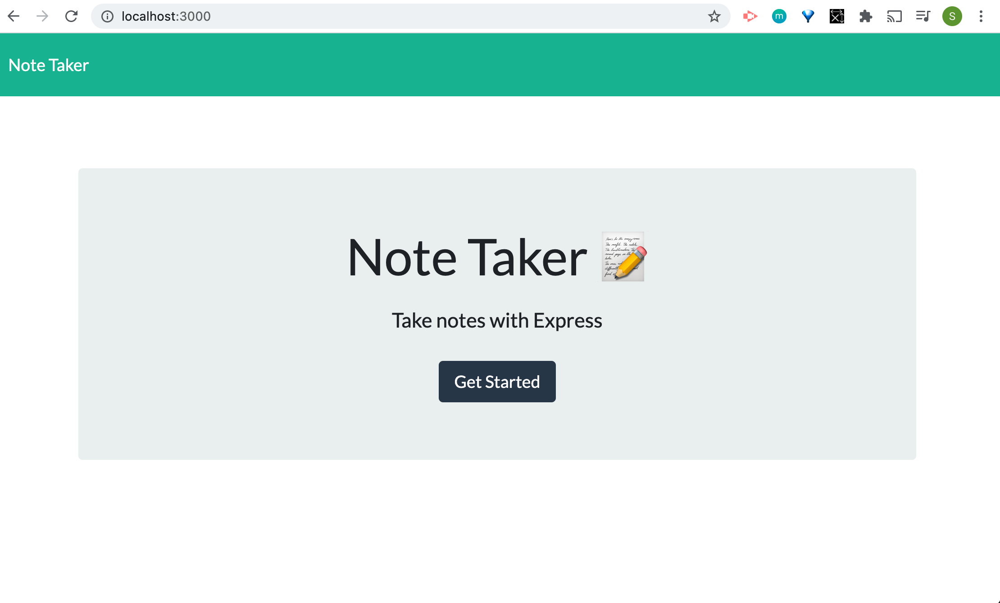
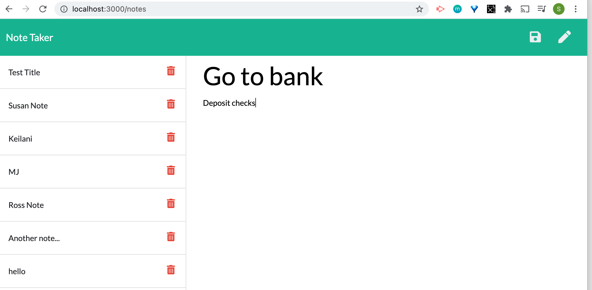
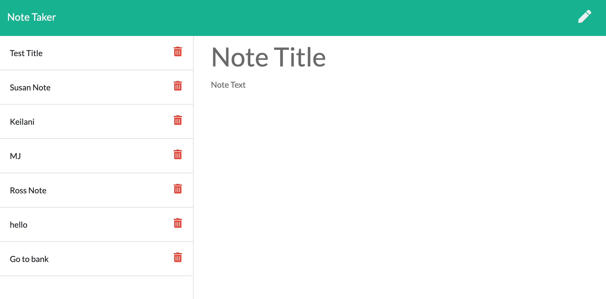

# Express.js Note Taker Application
  [](https://opensource.org/licenses/MIT)

  ## Description

  This note taker application is a full-stack web application that allows users to quickly and easily capture, view and delete notes they wish to keep track of. Users are able to quickly add a new note by typing in a note title and text and clicking the Save button. The note titles are displayed in a streamlined list on the left-hand side of the webpage, allowing them to quickly click on and view the details of previous notes they have saved, as well as to delete individual notes or create and save new ones.

  ## Table of Contents

  * [Installation](#installation)
  * [Usage](#usage)
  * [Screenshots](#screenshots)
  * [License](#license)
  * [Contribute](#contribute)
  * [Questions](#questions)
 
  ## Installation

  To install necessary dependencies, run the following command:

  ```
  npm i
  ```

  ## Usage

  This is a student repo.


  ## Screenshots

  
  
  
  

  ## License

  [](https://opensource.org/licenses/MIT) This project is licensed under the [MIT](https://opensource.org/licenses/MIT) license.

  ## Contribute

  Contributions are always welcome! (Please fork and pull request only.)

  ## Questions

  If you have any questions about the repo, open an issue or contact me directly at susan.fujii@me.com. You can find more of my work at [srfujii](https://github.com/srfujii/).

